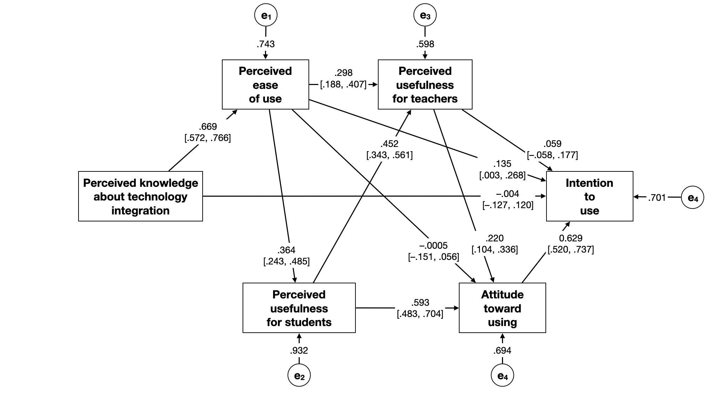
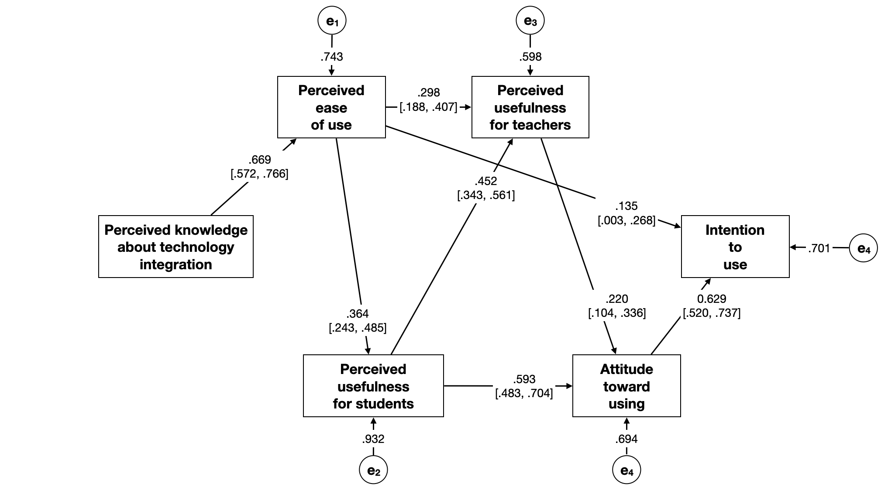

```{r setup, include=FALSE, message=FALSE}
# Load libraries
library(broom)
library(knitr)
library(kableExtra)
library(patchwork)
library(tidyverse)

knitr::opts_chunk$set(
  echo = FALSE, fig.width=6, fig.height=6, out.width='3in', fig.pos='H', warning=FALSE, message=FALSE
  )
```


This assignment is worth 15 points. 


# Part 1: Regression from Summary Values

**1. Compute the standardized regression coefficients for Model A.**

```{r echo=TRUE}
cor_mat = matrix(
  data = c(
    1.000, 0.219, 0.330, 0.521, 0.454, 0.696,
    0.219, 1.000, 0.669, 0.244, 0.309, 0.181,
    0.330, 0.669, 1.000, 0.364, 0.462, 0.270,
    0.521, 0.244, 0.364, 1.000, 0.560, 0.699,
    0.454, 0.309, 0.462, 0.560, 1.000, 0.530,
    0.696, 0.181, 0.270, 0.699, 0.530, 1.000
  ),
  nrow = 6
)

# Compute standardized coefficients
b_star = solve(cor_mat[c(-1, -4) , c(-1, -4)]) %*% cor_mat[1 , c(2:3, 5:6)]
b_star
```

\newpage


**2. Compute the $R^2$, adjusted-$R^2$ values for Model A.**

```{r echo=TRUE}
# Compute the R2 value
r2 = 1 - 1/diag(solve(cor_mat[-4, -4]))
r2[1]


# Compute adjusted R2
r2_adj = 1 - (231 / 227) * (1 - r2[1])
r2_adj
```

\vspace{2em}

**3. Compute the estimated residual standard error for Model A.**

```{r echo=TRUE}
# Compute estimated residual variance
s2_e =  sqrt(1 - r2_adj)
s2_e
```


\vspace{2em}

**4. Compute the standard errors for the regression coefficients for Model A.**

```{r echo=TRUE}
# Step 1: Create submatrix
sub_mat = 231 * cor_mat[c(-1, -4) , c(-1, -4)] + 232 * rep(0, 4) %*% t(rep(0, 4))
sub_mat

# Step 2: Bind n(M_x) to top of submatrix
mat_2 = rbind(232 * rep(0, 4), sub_mat)
mat_2

# Step 3: Bind vector to left of Step 2 matrix
XtX = cbind(c(232, 232 * rep(0, 4)), mat_2)
XtX

# Compute var-cov matrix of b
cov_b = s2_e * solve(XtX)
cov_b

# Compute SEs
se = sqrt(diag(cov_b))
se
```

# Part 2: Simulate Data

**5. Simulate the study's data based on the summary values provided. Assume multivariate normality among the measures. Show the first six rows of the simulated data. Also include your syntax.**

```{r echo=TRUE}
# Make simulation reproducible
set.seed(57)

# Simulate the data
sim_dat <- MASS::mvrnorm(n = 232, mu = rep(0, 6), Sigma = cor_mat, empirical = TRUE)

# Convert to data frame
sim_dat = data.frame(sim_dat)

# Change column names
names(sim_dat) = c("intend", "knowledge", "ease", "students", "teachers", "attitude")

# View data
head(sim_dat)
```

# Part 3: Path Analysis: All Hypothesized Paths

**6. Use the data you simulated in Part 2 to fit all the relevant regression models in the path analysis. Re-draw the path model and include all the estimated path coefficients, 95% confidence intervals associated with these coefficients, and all error terms/disturbances in the model. (3pts)**

```{r eval=FALSE}
tidy(lm(ease ~ 1 + knowledge, data = sim_dat), conf.int = TRUE)
glance(lm(ease ~ 1 + knowledge, data = sim_dat), conf.int = TRUE)
sqrt(1 - 0.448)

tidy(lm(students ~ 1 + ease, data = sim_dat), conf.int = TRUE)
glance(lm(students ~ 1 + ease, data = sim_dat), conf.int = TRUE)
sqrt(1 - 0.132)

tidy(  lm(teachers ~ 1 + ease + students, data = sim_dat), conf.int = TRUE)
glance(lm(teachers ~ 1 + ease + students, data = sim_dat), conf.int = TRUE)
sqrt(1 - 0.642)

tidy(  lm(attitude ~ 1 + ease + teachers + students, data = sim_dat), conf.int = TRUE)
glance(lm(attitude ~ 1 + ease + teachers + students, data = sim_dat), conf.int = TRUE)
sqrt(1 - 0.518)

tidy(  lm(intend ~ 1 + teachers + ease + knowledge +attitude, data = sim_dat), conf.int = TRUE)
glance(lm(intend ~ 1 + teachers + ease + knowledge +attitude, data = sim_dat), conf.int = TRUE)
sqrt(1 - 0.508)
```

```{r out.width='6in'}

```


\vspace{2em}

<!-- 7. Create a publishable quality table that includes the direct, indirect, and total effects for all of the potential causes of intended technology use in the model. **(2pts)** -->


# Part 4: Path Analysis: Empirically Supported Paths

**7. Use the confidence intervals associated with the path coefficients to evaluate the researchers' hypotheses that all the effects are positive. Based on these evaluations, re-draw the path model. Omit any paths for hypotheses in the model that are not empirically supported. (2pts)**

```{r out.width='6in'}

```


\vspace{2em}

**8. Create a publishable quality table that includes the updated direct, indirect, and total effects for all of the potential causes in the updated path model. (2pts)**

```{r}
data.frame(
  Measure =  c("knowledge", "ease", "students", "teachers", "attitude"),
  Direct =   c("---", "0.135", "---", "---", "0.629"),
  Indirect = c("0.223", "0.200", "0.436", "0.138", "---"),
  Total =    c("0.223", "0.335", "0.436", "0.138", "0.629")
)  %>%
  kable(
    caption = "Standardized direct, indirect, and total effects of substantive predictors related to the intention to use technology.",
    col.names = c("Measure", "Direct", "Indirect", "Total"),
    align = c("l", "c", "c", "c"),
    format = 'latex',
    booktabs = TRUE
  ) %>%
  add_header_above(c(" " = 1, "Effect" = 3)) %>%
  kable_styling(latex_options = c("HOLD_position"))
```

\vspace{2em}

**9. Consider the following research question: *How does student teachers' perceived ease of use of technology  influence their intention to use technology in education?* Use the results from the updated path model to provide an answer to this question. Your response, written in prose (a few sentences), should clearly provide an answer to this question by drawing on the relevant effects in the updated path model. (2pts)**

The path model suggests that the effects of perceived ease of use of technology directly and indirectly effect student teachers' intention to use technology in education. The direct, positive effect suggests that the easier student teachers perceive that technology is to use, the higher their intention to use it. The indirect effects of perceived ease of use of technology are more influential than the direct effect. Indirectlly, perceived ease of use influences perceptions about technology's usefulness to students. This in turn affects (1) perceptions of technology's usefulness to students which in turn affects attitudes toward using technology which in turn affects intention to use technology; and (2) attitudes toward using technology more directly which in turn affects intention to use technology.

